**CMIT 495 Current Trends and Projects in Computer Networks and
Security**

*Week 2 – Cloud Computing*

1.  **Log in to your newly created AWS account and take a screenshot of
    the AWS Management Console (Dashboard) and paste it below
    question 1. The screenshot should include the username you created
    during the setup phase.**

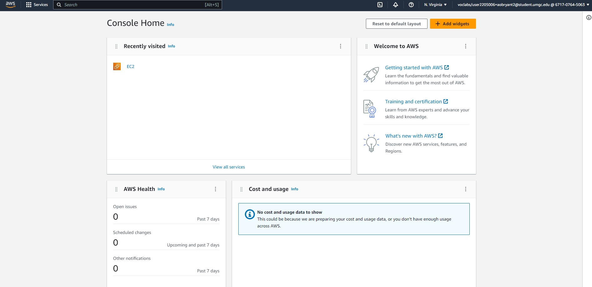

2.  **Launch a Windows Virtual Machine (VM). Provide a detailed overview
    of the steps required to install the Microsoft Windows operating
    system (OS) on the VM. The steps may be listed in the form of bullet
    points or a summary with complete sentences. Use as much space as
    required. Finally, take a screenshot of the desktop and paste it
    with your response below this question.**

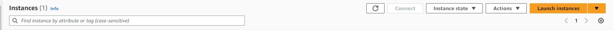

First, I logged into the AWS EC2 Dashboard from the AWS Home Dashboard.
Then, I select “Launch Instances”.

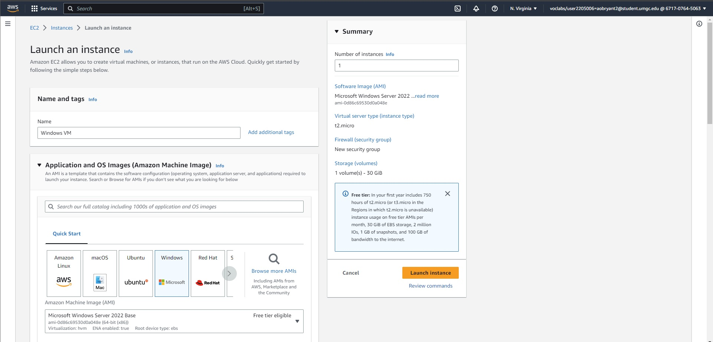

Next, I named my server and selected the Windows OS to run on my
instance.

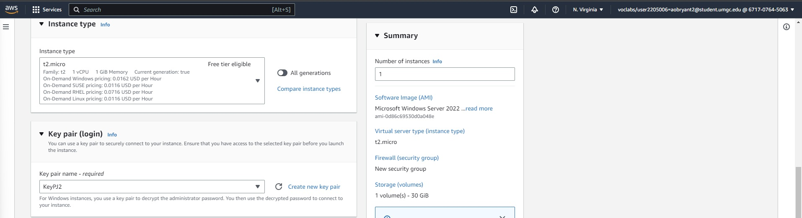

Third, I selected the free tier instance type and created a Key Pair for
my instance.

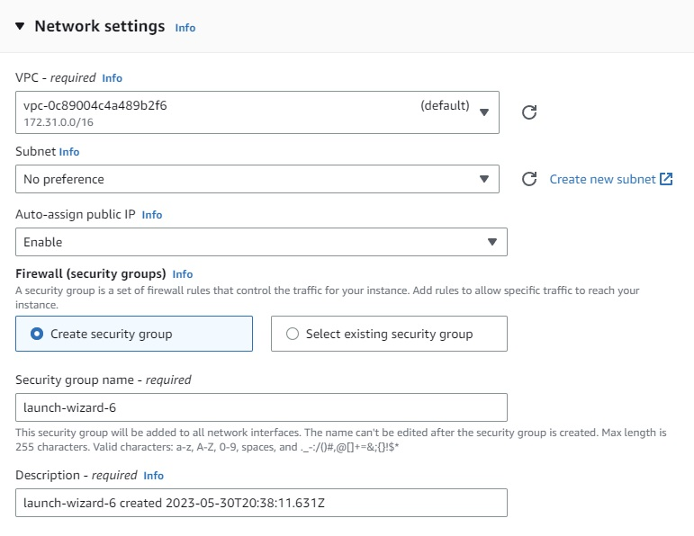

Then, I kept my Network Settings at the defaults.

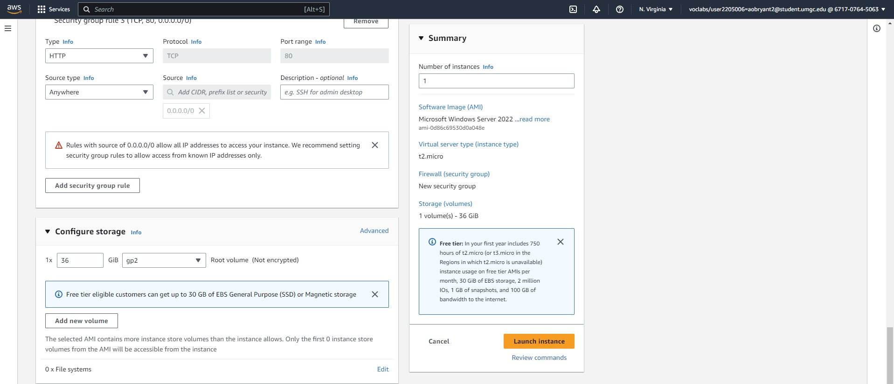

Lastly, I reviewed my configurations on the Summary box to ensure that
everything is correct.

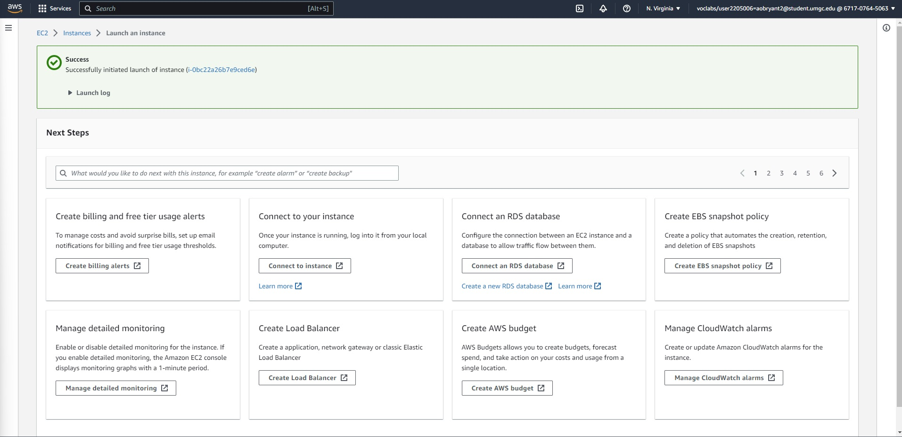

Since everything was correct, I launched my Windows VM!

3.  **Using what you learned from Project 1, provision and launch a new
    AWS EC2 Ubuntu Linux Server and connect to it via the SSH protocol.
    Note any challenges or opportunities associated with this
    provisioning.**

I attempted to build an AWS EC2 Ubuntu Linux Server, and the process
went a lot smoother compared to last time. The process becomes muscle
memory since I knew the specifications needed to deploy the instance. I
was able to play around with creating a new Key Pair and configuring
different Security Settings in the build.

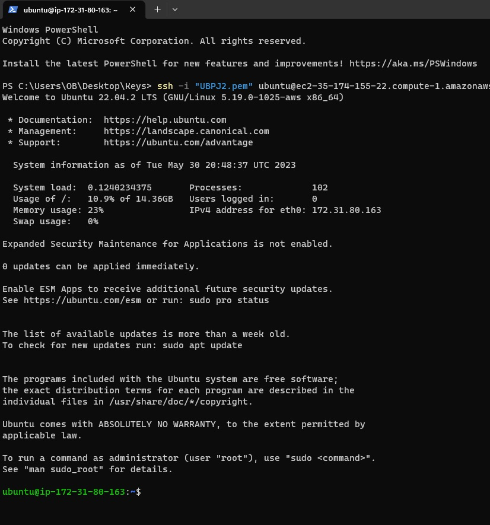

4.  **Using AWS, *create a network file system* with Amazon Elastic File
    Systems (EFS) and attach it to the running Ubuntu Server instance.
    You may use the
    [AWS](https://docs.aws.amazon.com/efs/latest/ug/how-it-works.html)
    *web page* for step-by-step instructions and understand how the EFS
    works. Take a screenshot of the result and embed it below.
    Specifically, take a screenshot to verify *that your file system has
    been successfully mounted*, along with the results from *creating a
    test file in your new file system. This will be done by running a
    simple dd command to generate a 1GiB file in your new directory.*
    Finally, describe the value of a network file system.**

> 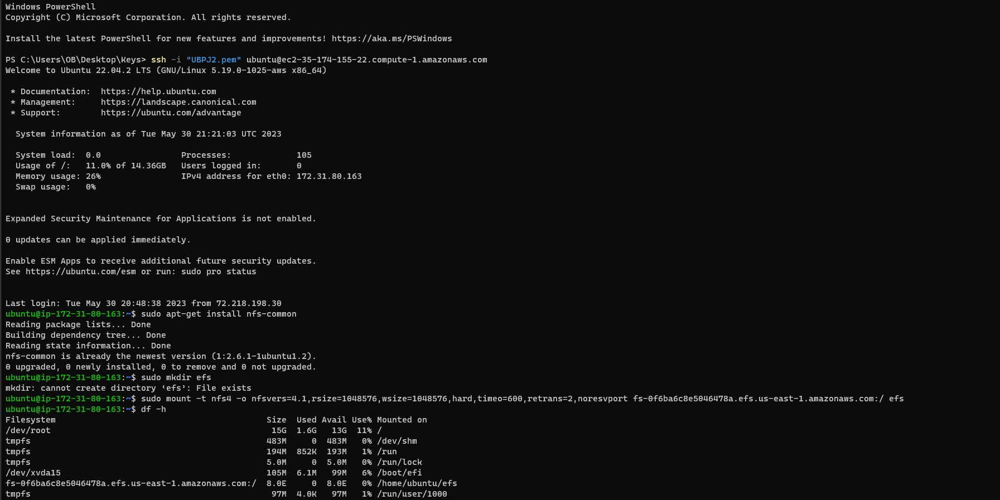 alt="A screenshot of a computer Description automatically generated with medium confidence" />
>
> 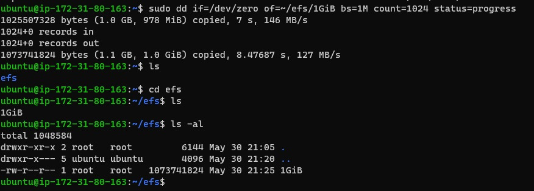 alt="A computer screen with white text Description automatically generated with low confidence" />

5.  **Using the AWS platform, create an S3 bucket and upload any file to
    the S3 bucket. Take a screenshot showing the file was uploaded to
    the S3 bucket and paste it below. If necessary, use the AWS webpage
    above for step-by-step instructions.**

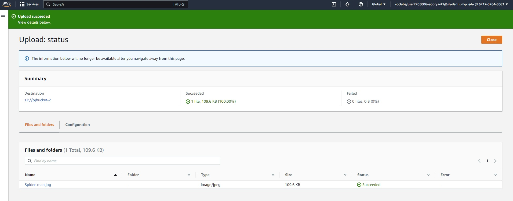

6.  **The CTO will be reviewing this document. You have shown how easy
    it is to provision a Microsoft OS using the AWS platform. The CTO
    chose AWS because it offered a free account. She will now expect a
    recommendation from you on what cloud service to use for the
    organization’s PaaS (e.g., the infrastructure, OS, runtime, etc.)
    needs. There is no need for a private cloud, so the public option
    will work just fine. Describe the difference between the Google
    Cloud platform, Amazon AWS platform, and Microsoft Azure platform.
    Provide a recommendation for the CTO as to which service provider
    you would recommend and why. Be explicit and detailed in your
    recommendation.**

The three leading cloud platforms offer the same services with the
guarantee that all data will be safe and secure. They all can scale a
user’s operation effortlessly and the transition from server-based to
serverless is often described as effortless. However, there is only one
platform I would trust and that would be Amazon AWS Cloud platform.
Their pay-as-you-go pricing model allows users to pay for the services
they use. When the usage increases or decreases during certain times of
the day, the infrastructure scales up or scales down to meet demand.
When it comes to scalability, AWS has more availability zones than its
competitors. More availability zones mean there is less chance of
latency and scaling will enable more customers to interact with the
user’s product.

7.  **The CTO approved your comparative analysis between the cloud
    service providers (i.e. Amazon, Google, and Microsoft). She has
    decided to proceed with an [Amazon Virtual Private Cloud (Amazon
    VPC)](https://docs.aws.amazon.com/vpc/latest/userguide/what-is-amazon-vpc.html).
    The Amazon VPC en**a**bles one to launch AWS resources into a
    virtual network, which is similar to a traditional network that can
    be operated in an on-premises data center. Keep in mind that
    networking, storage, and security associated with a VPC are as
    important as the overall scalable infrastructure of AWS.**

    1.  **To begin, the CEO would like you to provide the network
        settings needed to provision two (2) subnets for the VPC as
        shown in the table below:**

| **Subnet** | **End-User** | **CIDR** | **Network** | **Broadcast** | **Mask** |
|----|----|----|----|----|----|
| **A** | **Developers** | **146.38.70.105/20** | ***146.38.64.0*** | ***146.38.79.255*** | ***255.255.240.0*** |
| **B** | **Marketing** | **172.31.0.0 /16** | ***172.31.0.0*** | ***172.31.255.255*** | ***255.255.0.0*** |

2.  **Based on your understanding, list the network address, broadcast
    address, and subnet mask for subnet A and subnet B in the table
    above. Perform the necessary calculations and explain how you
    arrived at your answer.**

Calculating the missing information was no easy task but I believe I got
the hang of this. For the sake of this question, I will be using the
Developers’ Subnet as an example. The easiest conversion is converting
CIDR to subnet mask. Each byte of an IP address has 8 bits within it. I
found a conversion table that details the relationship between the
number of binaries and their decimal equivalent. Regarding the
Developers’ IP address, I was able to determine that the first two bytes
held the octet. According to the chart, an octet is the decimal
equivalent of 255. The third byte was limited to 4 binary 1s and this is
because the CIDR ends with “/20”. 16 of the “/20” can already be found
in the first two bytes so the remaining four would be in the third byte.
The decimal equivalent of 4 binary 1s is 240. Lastly, since there is no
more room for binary 1s the last byte will be zero.

To find the subnet network and broadcast IP, I was able to find a
conversion calculator in my search browser. Utilizing Open-Source
Information allowed me to find the IP addresses for the subnets.

**To better help you understand IP addressing, IP subnetting, and IP
address summarization, review the following AWS documentation prior to
answering the questions in this section:**

- **[VPCs and
  subnets](https://docs.aws.amazon.com/vpc/latest/userguide/VPC_Subnets.html)**

- **[CIDR and Peering for VPC and AWS Control
  Tower](https://docs.aws.amazon.com/controltower/latest/userguide/vpc-ct-cidr.html)**

- [**Subnet CIDR
  reservations**](https://docs.aws.amazon.com/vpc/latest/userguide/subnet-cidr-reservation.html)

**Note:**

**The key benefit of an Amazon VPC (or a virtual private network) is
that the internal network devices are not openly accessible via the
Internet and can only be accessed from within a secure network. Thus, it
keeps the proprietary applications and data protected.**

**Classless Internet Domain Routing (CIDR) notation: CIDR was introduced
as a means to primarily improve address space utilization as a result of
the rapid growth of the Internet and growth of the IP routing tables
held in the Internet routers. Represented by an IP prefix, CIDR moves
away from the traditional IP classes (e.g., Class A, Class B, Class C,
etc.). Subnetting a network address space using CCIDR leads to an
effective IP address space only for the number of hosts needed without
wasting IP addresses.**

8.  **Please note the following carefully. Confirm that you have
    <u>stopped</u> and <u>terminated</u> your Microsoft Windows virtual
    machine, <u>deleted</u> your file system from the Amazon EFS
    console, <u>deleted</u> the contents of your Amazon S3 bucket, and
    <u>deleted</u> your Amazon S3 bucket. To confirm, simply type your
    name below.**

> ***Aaron OBryant***
