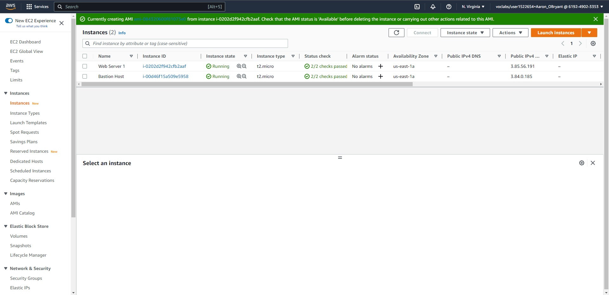
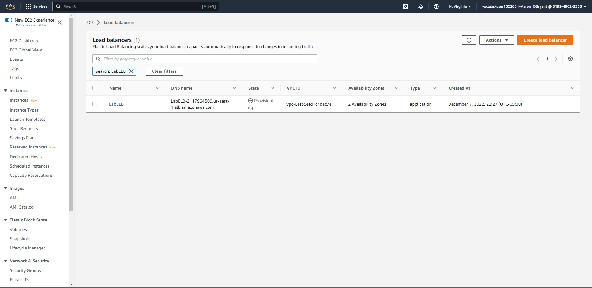
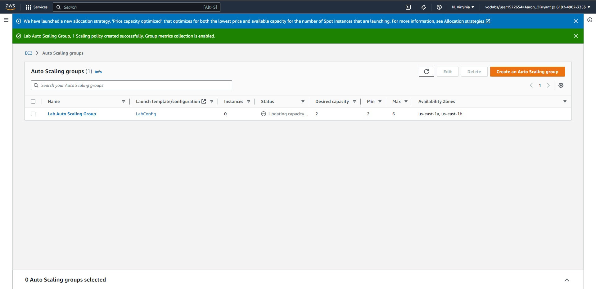
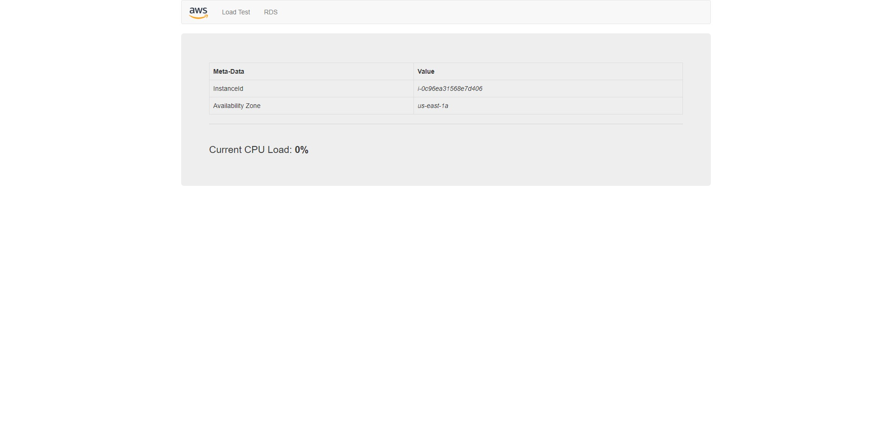
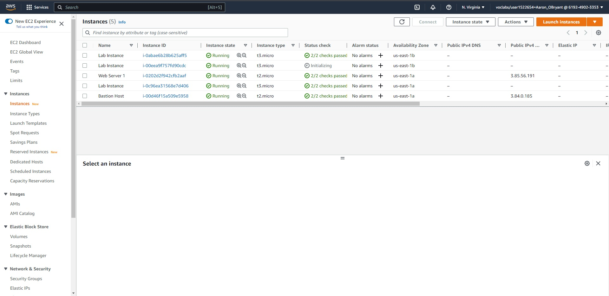
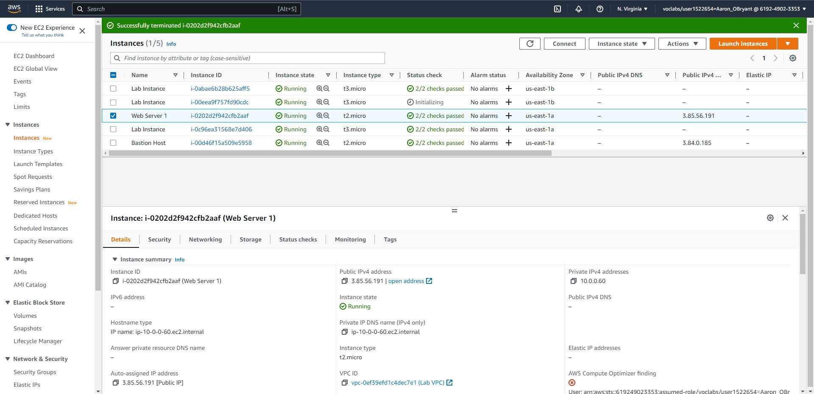

**Aaron OBryant**

**CMIT 326 7384**

**12/07/2022**

**Scale and Load Balance Your Architecture**

Task 1: Create an AMI for Auto Scaling

Task 2: Create a Load Balancer

Task 3: Create a Launch Configuration and an Auto Scaling Group

Task 4: Verify that Load Balancing is Working

Task 5: Test Auto Scaling

Task 6: Terminate Web Server 1

Lab Complete
