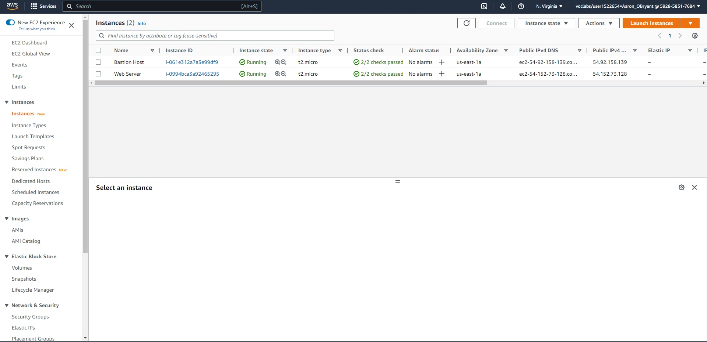
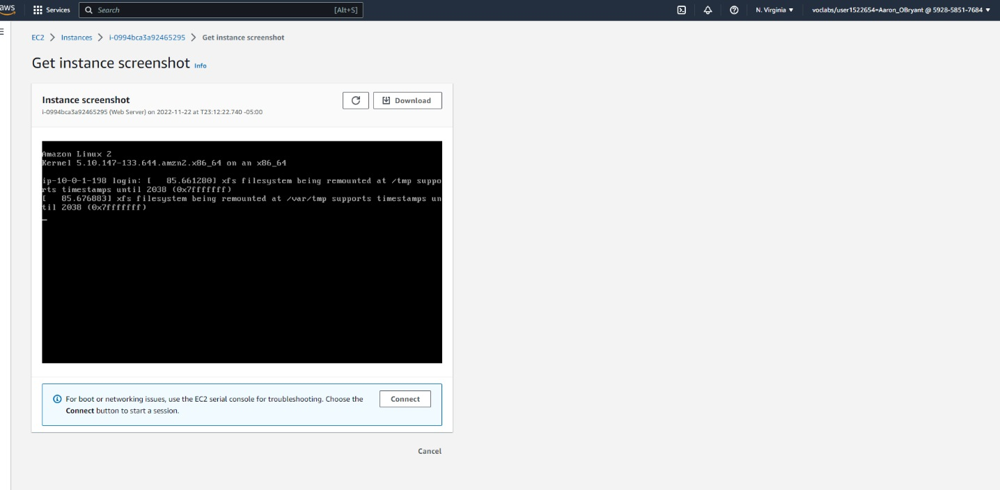
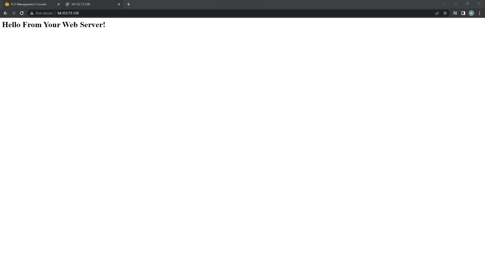
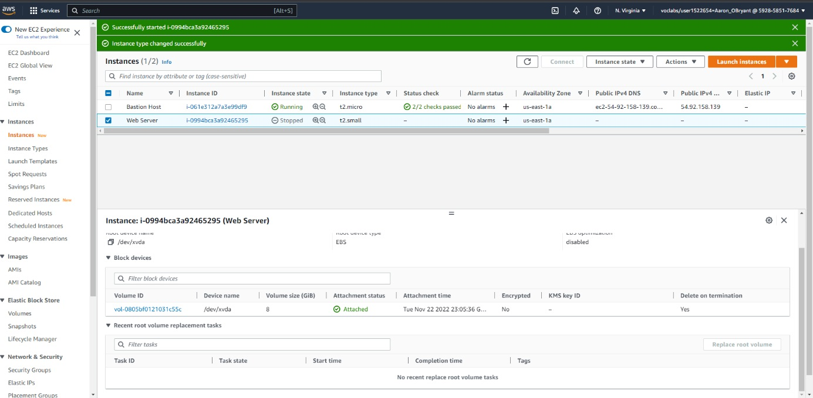
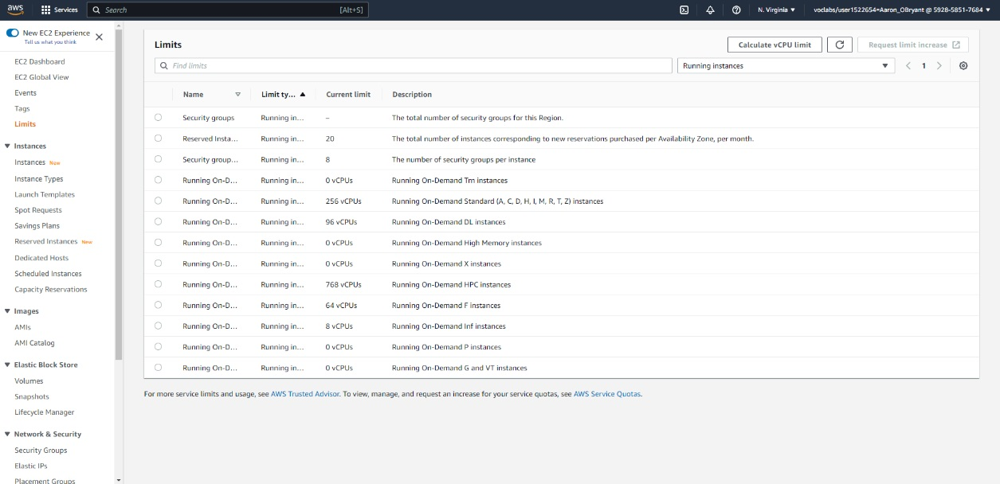
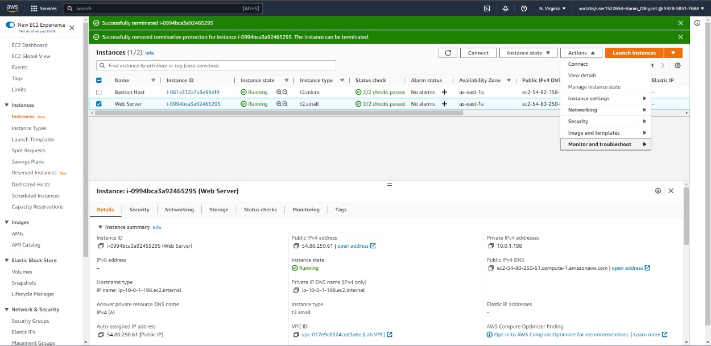

**Aaron OBryant**

**CMIT 326 7384**

**11/22/2022**

**Introduction to Amazon EC2 Lab**

Task 1: Launch Your Amazon EC2 Instance

Task 2: Monitor Your Instance

Task 3: Update Your Security Group and Access the Web Server

Task 4: Resize Your Instance: Instance Type and EBS Volume

Task 5: Explore EC2 Limits

Task 6: Test Termination Protection

Lab Complete
