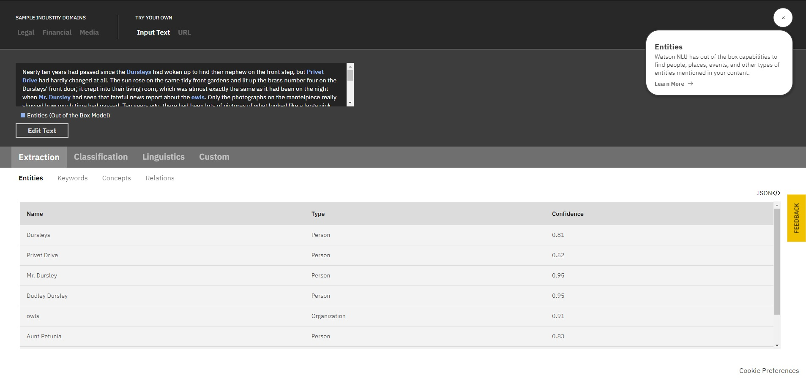
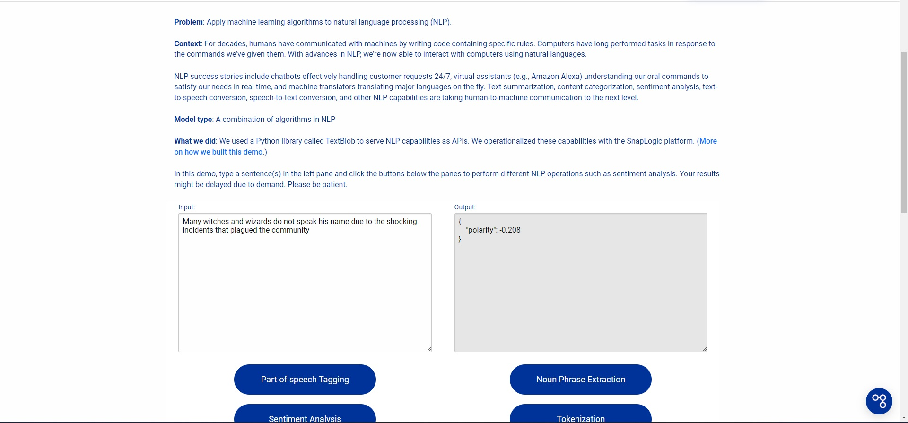
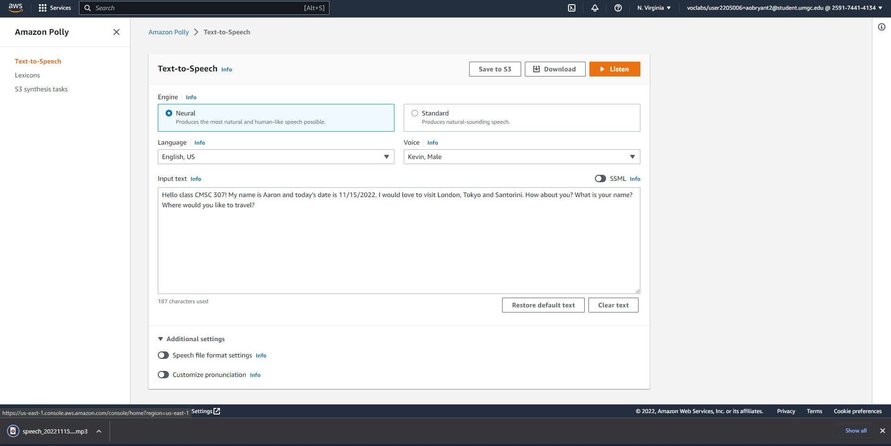
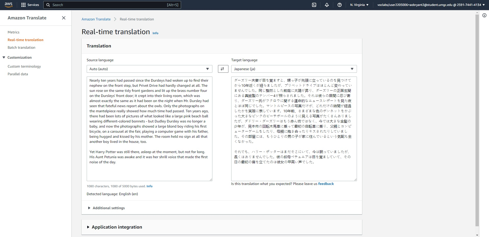
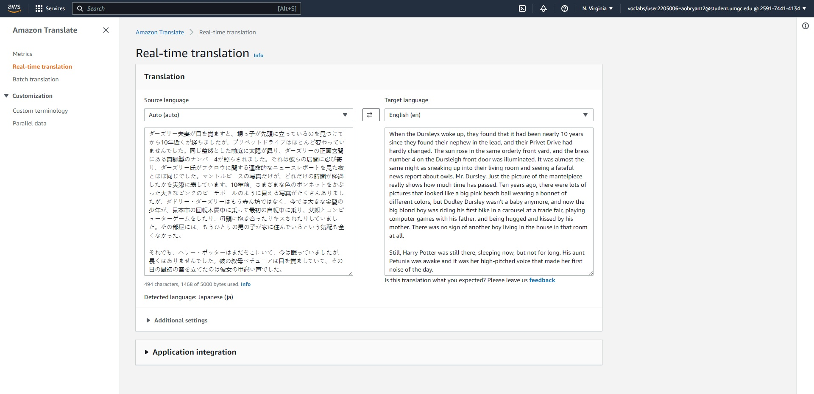
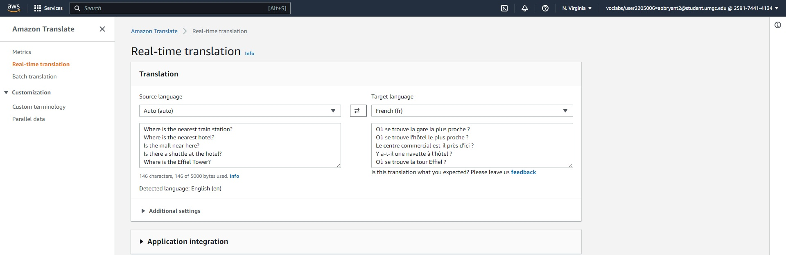
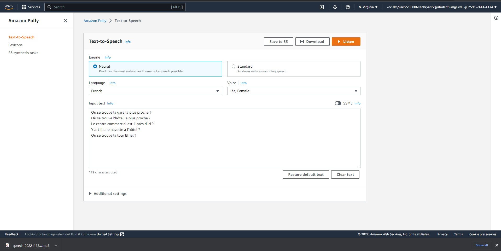

Aaron OBryant

11/15/2022

CMSC 307

Professor David Castillo

**Section 1.**

Natural Language Processing Artificial Intelligence is a branch of AI
that focuses on building machine that understand and respond to text or
voice data. Two services that house NLP AI are IBM and Snap Logic. I had
the chance to test both systems to see how they compare to one another,
and I can honestly say one is superior to the other. First, I inputted
two different sources for the systems to pull from and dissect. For IBM,
I entered an excerpt from *<u>Harry Potter and the Sorcerer’s Stone</u>*
and in Snap Logic, I typed a sentence stating, “Many witches and wizards
do not speak his name due to the shocking incidents that plagued the
community”. Starting with IBM NLP AI, I can honestly say that this
service is head and shoulders above the competition. After inputting my
text, the system gave such a detailed breakdown of the excerpt. For
example, under the tab labeled Extraction the text is dissected, and
Keywords, Relations and Concepts are discussed. But the subtab I was
most impressed with was the Entities tab where the program went through
the text and pulled out a person, place or thing and categorized it.
That word is then given a percentage of whether the AI categorized it
correctly. If you look at Figure 1 you can see the Entities and you can
see IBM is 91% confident that the word “owls” is describing an
organization. In the Harry Potter universe, owls are the same as mail
workers and they deliver parcels to families and not only viewed as an
“object”.

(Figure 1. IBM’s NLP AI)

When it comes to Snap Logic’s NLP AI, I honestly feel like it does not
really compare to IBM’s. The program is not user-friendly, the output
data is difficult to understand and there is no explanation. I inputted
a sentence into the NPL and clicked on the Sentiment Analysis and the
output made no sense to me as seen in figure 2. I attempted to find a
key but I could not find one so I can conclude this program is one of
the worst.

(Figure 2. Snap Logic’s NPL AI)

**Section 2.**

Logging into the Aws Management Console I was able to search for Amazon
Polly in the search bar. After entering the text, I was sent to the
service’s main page.

(Figure 3. Entered Amazon Polly service)

Next, I clicked on the option to try out Polly and was taken to the next
screen. On this page I had to input a unique greeting for my new
classmates. In Text-to-Speech, I greeted the class, introduced myself
and listed some places I would like to visit in the future. Then, I
selected the preferred spoken language and the voice I would like to
speak. Finally, I downloaded the finished product to hear the outcome.

(Figure 4. Entered and downloaded Welcome message in Polly)

**Section 3.**

After trying out Amazon Polly, I searched for Amazon Translate in the
search bar. After my search was complete, I was transported to Amazon
Translate’s main
page.

(Figure 5. Successfully entered Amazon Translate)

I launched the translation service and entered an excerpt from *<u>Harry
Potter and the Sorcerer’s Stone</u>*. I opted to convert the English
text to Japanese characters.

(Figure 6. Translated an excerpt from Harry Potter and Sorcerer’s Stone
to Japanese)

Then, I reversed the process and copied the Japanese text into the
source language and selected English as my source language. The result
was the original text with some small mistakes. That is acceptable
because language is not universal, and some languages syntax is
different than others.

(Figure 7. Translated excerpt from Japanese back to English)

**Section 4.**

Using both Amazon Polly and Amazon Translate as travel buddies is an
incredible idea. I was able to ask five simple and common questions in
Amazon Translate to get me by on my imanginary first day in France.

(Figure 8. Translated questions from English to French)

Next, I copied the translated questions into Amazon Polly to hear how
particular questions are asked.

(Figure 9. Downloaded Travel Questions)

**Section 5.**

NLP AI services are a great tool to use for almost everyday use. If you
are taking a trip out of the country or sending a message to a visually
impaired coworker, NLP AI works. The strengths and weaknesses of this
branch of AI relies on the provider housing the program. Sites like AWS
and IBM have a great system with a great NLP AI whereas Snap Logic is
not up to par. With its ease and accessibility, AWS has the best
program. **  
**
