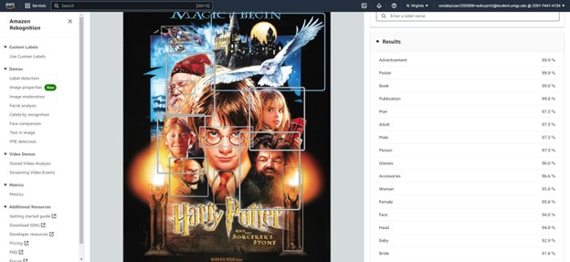

**Aaron OBryant**

**CMSC 307 7380**

**11/27/2022**

**  
**

**After logging into the AWS Console, I navigated to the Amazon
Rekognition tool as shown in figure 1 and figure 2.**

{width="6.5in" height="2.157638888888889in"}

**Figure 1. Successful login into AWS Console**

{width="6.5in"
height="1.9715277777777778in"}

**Figure 2. Navigated successfully to Amazon Rekognition**

**The Amazon Rekognition tool is used to identify people, places, or
things in images. By uploading certain pictures, the program will point
out specific details such as glasses, a boat, or a building. After
categorizing certain parts of the image, Rekognition then gives a
percentage of how confident it is that its identification is correct.
Figure 3 shows the splash page for one of the subpages for Amazon
Rekognition and that is label detection. Label detection is the main
tool used to label objects, scenes and actions as stated before.**

{width="6.5in"
height="1.8618055555555555in"}

**Figure 3. Navigated to label detection in Amazon Rekognition**

**I experimented with label detection three times in Amazon Rekognition,
and I can honestly say that I am pleased with the results. In Figure 1,
I researched an image of a HBCU's Homecoming and uploaded into label
detection. A detailed report identified many objects or people in this
illustration which includes a man and an adult.**

{width="6.5in" height="2.941666666666667in"}

**Figure 4. First upload and detection results.**

**While the program is confident in its decision with these two labels,
I also found it surprising that Rekognition was almost 100% certain that
this photo came from a comic. While the illustration is comic-like, it
is from Levelman.com from an article named "A Toast to HBCU Homecoming,
the Epicenter of Black Success." As shown in figure 2, I uploaded a
second image into the label detection tool, this time it is a photograph
of popular Disney characters at Disney World. This photo better
showcased the label detection's skills and that is evident by the
confidence ratings given to the identifications. With 96.4% confidence,
Rekognition identified "Theme Park" and "Amusement Park." I was also
surprised when the program identified "Fun" in the photo even though the
word "Fun" is not present. It amazed me how Rekognition could discern
the mood of a photo with near perfect accuracy.**

{width="6.5in" height="2.970138888888889in"}

**Figure 5. Second upload and detection results.**

**I uploaded a final photo into the label detection tool and this time
it is the movie poster for "Harry Potter and the Sorcerer's Stone." As
shown in figure 6, the close accuracy almost mimics the previous image's
report. I am still surprised that the tool determined that my photo is
an advertisement with 99.9% confidence. Not only that but with 99.8%
confidence label detection believed that the poster is a book. As many
know, "Harry Potter and the Sorcerer's Stone" is a movie based on the
book of the same name.**

{width="6.5in" height="2.9868055555555557in"}

**Figure 6. Third upload and detection results.**

**Amazon Rekognition also has a celebrity recognition feature where I
can upload an image of a celebrity and the system identifies that
person. First, I uploaded a picture of Nipsey Hussle in the tool and he
was correctly identified as shown in figure 7. Figure 8 shows the
results of my upload of Chadwick Boseman into the system and with 99%
confidence he was identified. The same trend persisted in figure 9 where
a photo of J. Cole was identified.**

{width="6.5in"
height="1.6895833333333334in"}

**Figure 7. Nipsey Hussle correctly recognized.**

{width="6.5in"
height="1.86875in"}

**Figure 8. Chadwick Boseman correctly recognized.**

{width="6.5in"
height="1.8423611111111111in"}

**Figure 9. J. Cole correctly recognized.**

**Amazon Rekognition gives a glimpse of what computer vision AI really
is and how it is used. Computer vision is a field of study in AI where
cameras are used to identify persons of interest. These persons could be
victims of crimes or suspects and they are identified by physical
characteristics. These characteristics range from their face structure
to the way an individual walks. Computer vision can be used in many
arenas to assist human work and make life a little more convenient. For
example, Google Translator uses computer vision to translate signage
from its native language to the user's preferred language (IBM). This is
possible when a user uses their camera to take a photo of a sign and
uploads the picture into the application. In the Entertainment realm,
computer vision was used to clip together highlights of the 2018 Masters
golf tournament. To do this, IBM's Watson watched hours of the
tournament and identified reaction sounds of spectacular shots and
clipped them together.**

**  
**

**References**

- **Bucolo, D. (2021, March 23). *Pros and cons of visiting Disney world
  in 2021*.
  EatSleepCruise.com. <https://eatsleepcruise.com/visiting-walt-disney-world-in-2021/>**

- **Griffith, J. (2020, August 29). Hollywood remembers Chadwick Boseman
  as \'superstar on screen and in life\'. NBC News.
  https://www.nbcnews.com/pop-culture/celebrity/hollywood-remembers-chadwick-boseman-superstar-screen-life-n1238779**

- **IBM. (n.d.). *What is computer
  vision?* https://www.ibm.com/topics/computer-vision**

- **IMDb. (2001, November 16). *Harry Potter and the sorcerer\'s stone
  (2001)*. <https://www.imdb.com/title/tt0241527/>**

- **IMDb. (n.d.). *J. Cole*. https://www.imdb.com/name/nm3359577/**

- **IMDb. (n.d.). *Nipsey
  Hussle*. https://www.imdb.com/name/nm2596169/**

- **LEVEL Man. (2022, October 24). *A toast to HBCU homecoming, the
  epicenter of Black
  success*. <https://www.levelman.com/hbcu-homecoming-epicenter-black-success/>**
