**Aaron OBryant**

**CMSC 307 7380**

**12/11/2022**

**  
**

**Step 3**

**Data can be found everywhere and is collected every day. Data can be
almost anything ranging from crime rates of San Diego to the box office
results from the past 10 years. Data can be housed in data sources
website where information is freely accessible and exchanged. One
website where data is placed can be found at
<https://catalog.data.gov/dataset>. Data.gov has hundreds of thousands
of datasets on file in their system and each dataset details information
on a given subject. For example, I downloaded a dataset titled “Crime
Data from 2020 to Present” by clicking the dataset on the homepage and
download the information onto an Excel sheet. The download of the
dataset was easily transposed into Excel, and I was able to make table
out of the data. The information in this dataset details the date and
time a crime is reported as well as location. The report also names the
type of crime committed, weapons involved and victim’s age. Figure 1
shows a small example of how detailed this dataset gets and how
informative this data can be.**

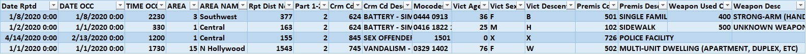

**Figure 1: “Crime Data from 2020 to Present” dataset**

**I could use a chatbot application that utilizes keywords for law
enforcement agents to track crimes. An officer could type in specific
weapon descriptions and receive the number of crimes associated with
that description. Or another use could be record keeping or building
reports for upper leadership.**

**Step 4**

After logging into the AWS Management Console, I searched Amazon Lex in
the search bar as seen in figure 2.

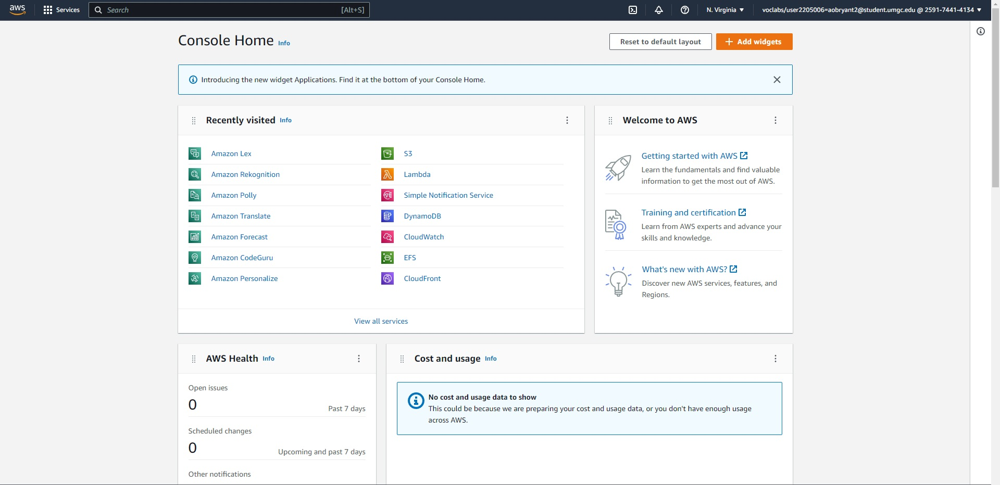

**Figure 2. Successful logging into AWS Management Console**

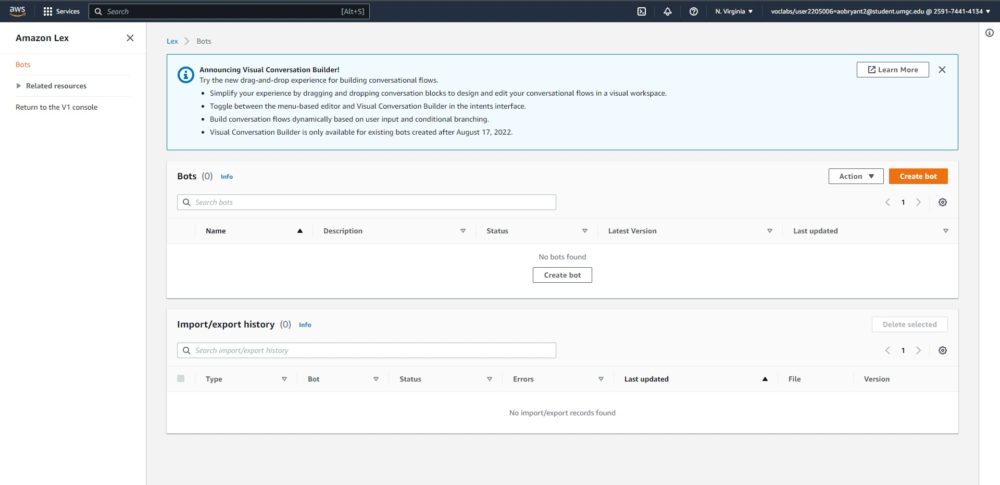

**Figure 3. Navigated to Amazon Lex successfully**

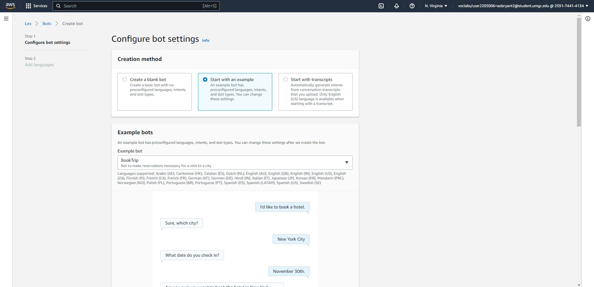

**Figure 4. Configuration page**

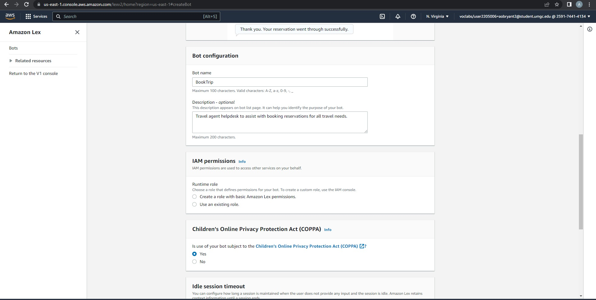

**Figure 5. Successfully configuring chatbot settings**

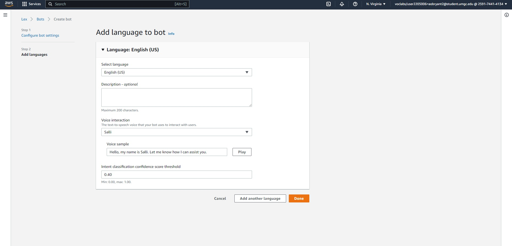

**Figure 6. Language confirmation**

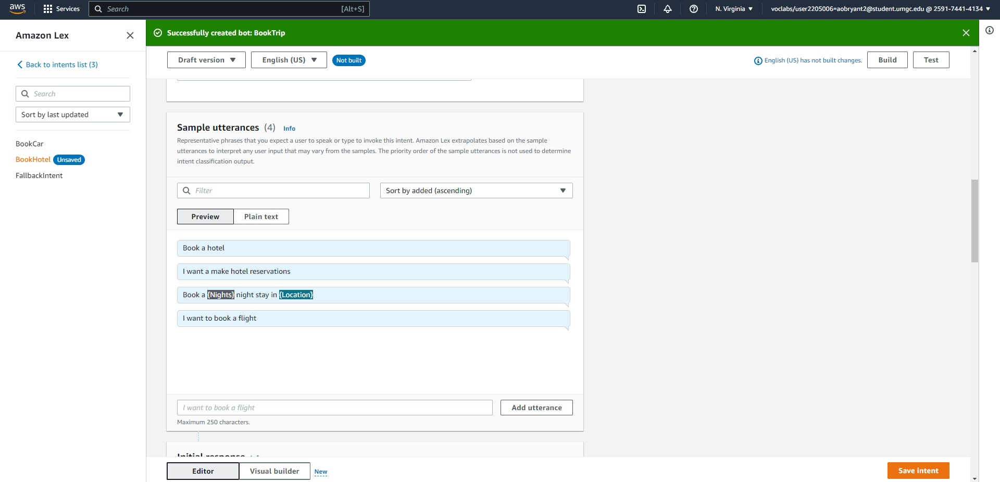

**Figure 7. Updated sample utterances**

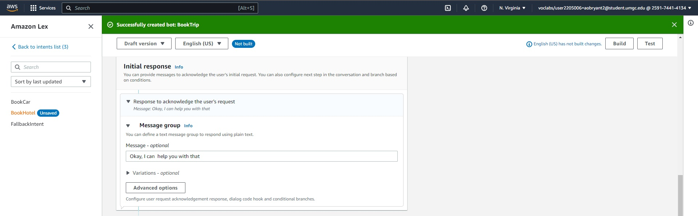

**Figure 8. Updated Initial response message**

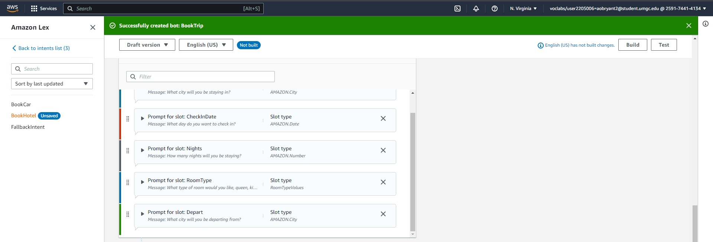

**Figure 9. Successfully created Slots for intent**

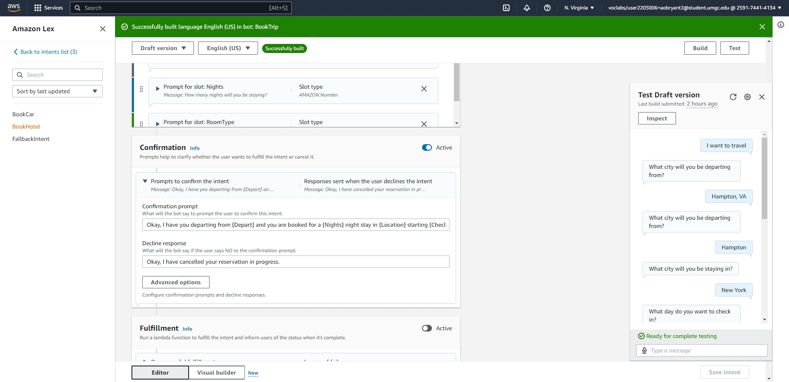

**Figure 10. Updated Confirmation prompt to highlight new slots**

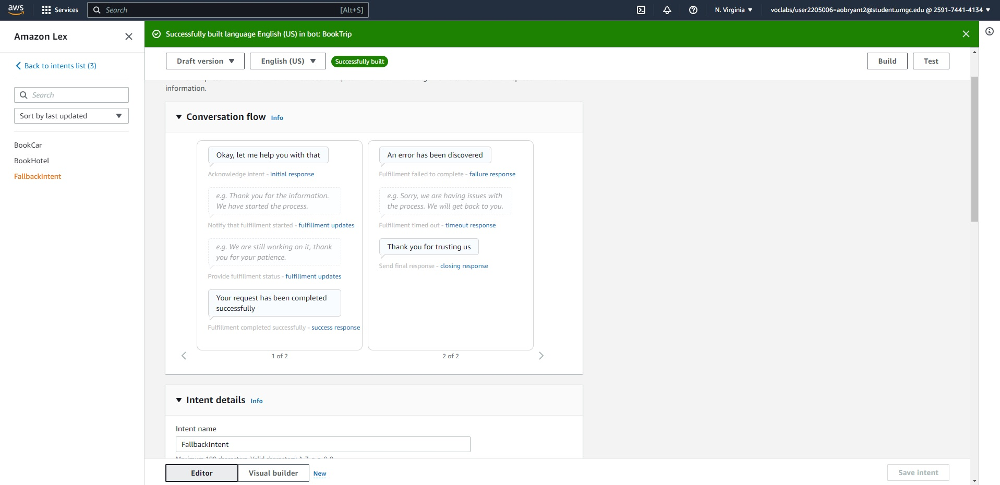

**Figure 11. Updated FallbackIntent**

**References**
